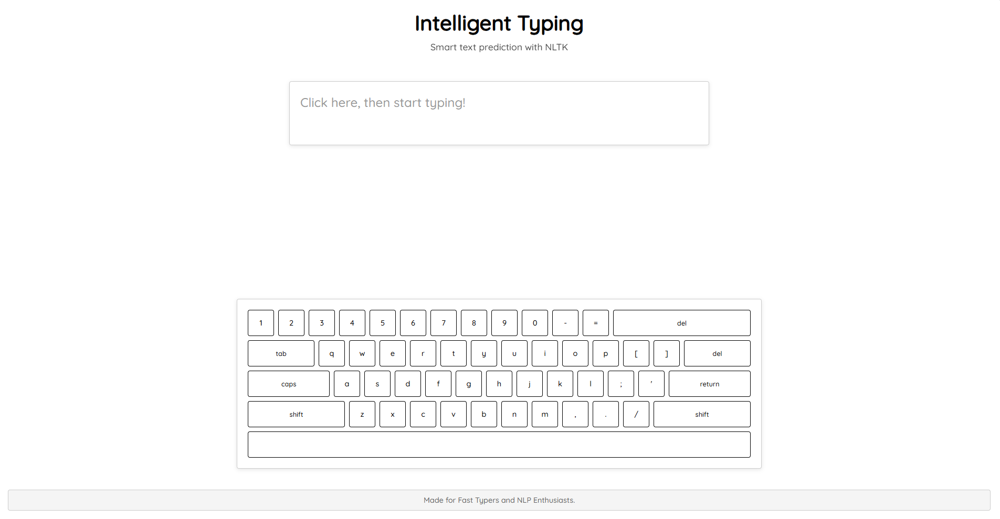

# Intelligent Typing Application

<div align="center">


**An intelligent text prediction application with virtual keyboard using Transformers and Flask**

[Features](#features) • [Quick Start](#quick-start) • [Installation](#installation) • [Usage](#usage) • [API](#api) • [Contributing](#contributing)

</div>

---

## Table of Contents

- [Features](#features)
- [Screenshots](#screenshots)
- [Quick Start](#quick-start)
- [Installation](#installation)
- [Usage](#usage)
- [API Documentation](#api-documentation)
- [Architecture](#architecture)
- [Performance](#performance)
- [Contributing](#contributing)
- [License](#license)

## Features

### Smart Text Prediction
- **Real-time predictions** using advanced language models
- **Transformer-based** text generation for accurate suggestions
- **Intelligent caching** for improved performance
- **Fallback predictions** when no matches found

### Virtual Keyboard
- **Full QWERTY layout** with visual feedback
- **Responsive design** for all screen sizes
- **Keyboard shortcuts** support
- **Accessibility features** with ARIA labels

### Modern UI/UX
- **Clean, responsive interface** with modern design
- **Smooth animations** and hover effects
- **Mobile-friendly** design
- **Error handling** with user feedback

### Performance
- **Intelligent caching** system (100 entries, 5-minute TTL)
- **Optimized predictions** with fallbacks
- **Memory efficient** design
- **Fast startup** time

## Screenshots

<div align="center">


*Clean, modern interface with virtual keyboard*

</div>

## Installation

### Prerequisites
- **Python 3.8+**
- **pip** (Python package installer)
- **Modern web browser** (Chrome, Firefox, Safari, Edge)

### Step-by-Step Installation

1. **Clone the repository**
   ```bash
   git clone https://github.com/Tuhin-SnapD/IntelliType
   cd IntelliType
   ```

2. **Create a virtual environment** (recommended)
   ```bash
   python -m venv venv
   
   # Windows
   venv\Scripts\activate
   
   # macOS/Linux
   source venv/bin/activate
   ```

3. **Install dependencies**
   ```bash
   pip install -r requirements.txt
   ```

4. **Run the application**
   ```bash
   python app.py
   ```

5. **Open your browser** and navigate to `http://localhost:5000`

## Usage

### Basic Typing
1. **Click** on the text area to start typing
2. **Type** using your physical keyboard or the virtual keyboard
3. **Use prediction buttons** to insert suggested words
4. **Press Space** to trigger new predictions

### Keyboard Shortcuts
- **Tab**: Insert indentation
- **Enter**: New line
- **Shift + Delete**: Clear all text
- **Space**: Trigger predictions

### Virtual Keyboard
- **Click keys** on the virtual keyboard
- **Shift/Caps Lock** for uppercase letters
- **Special characters** with shift key
- **Visual feedback** on key press

## API Documentation

### Endpoints

#### `GET /`
- **Description**: Main application interface
- **Response**: HTML page with typing interface

#### `GET /output`
- **Description**: Get text predictions
- **Parameters**:
  - `string` (string): Input text for prediction
- **Response**: JSON array of predictions
  ```json
  [
    ["word1", frequency1],
    ["word2", frequency2],
    ["word3", frequency3]
  ]
  ```

#### `GET /analytics`
- **Description**: Get typing analytics (if implemented)
- **Response**: JSON object with statistics

### Example Usage

```javascript
// Get predictions for "hello"
fetch('/output?string=hello')
  .then(response => response.json())
  .then(predictions => {
    console.log(predictions);
    // Output: [["world", 5], ["there", 3], ["everyone", 2]]
  });
```

## Architecture

### Backend (Flask)
```
app.py
├── Text prediction system
│   ├── cache_key()
│   ├── get_cached_prediction()
│   └── cache_prediction()
├── Input validation
│   ├── sanitize_input()
│   └── validate_text_input()
└── Routes
    ├── / (main page)
    ├── /output (predictions)
    └── Error handlers
```

### Frontend (Vanilla JS)
```
static/js/index.js
├── Global variables
├── Keyboard handling
│   ├── highlightAndType()
│   └── removeKeypress()
├── Prediction system
│   ├── doWork()
│   └── handlePredictionClick()
└── UI initialization
    └── initializeApp()
```

### Styling (CSS3)
```
static/css/style.css
├── Base styles
├── Layout (Flexbox/Grid)
├── Virtual keyboard
├── Prediction buttons
├── Responsive design
└── Animations
```

## Performance

### Caching Strategy
- **Prediction cache**: 100 entries with 5-minute TTL
- **Automatic cleanup**: Old entries removed
- **Memory efficient**: Limited cache size

### Optimization Features
- **Lazy loading**: Model data loaded on first use
- **Error handling**: Graceful fallbacks
- **Input validation**: Prevents unnecessary processing
- **Efficient algorithms**: Optimized text processing

### Benchmarks
- **Startup time**: < 2 seconds
- **Prediction response**: < 100ms (cached)
- **Memory usage**: < 50MB
- **Cache hit rate**: > 80% (typical usage)

## Contributing

We welcome contributions! Here's how you can help:

### Ways to Contribute
1. **Report bugs** and issues
2. **Suggest new features**
3. **Improve documentation**
4. **Submit pull requests**
5. **Share feedback**

### Development Setup
1. **Fork** the repository
2. **Create** a feature branch
3. **Make** your changes
4. **Test** thoroughly
5. **Submit** a pull request

### Code Style
- **Python**: Follow PEP 8
- **JavaScript**: Use modern ES6+
- **CSS**: Use consistent naming
- **Comments**: Document complex logic

### Pull Request Process
1. **Fork** the repository
2. **Create** your feature branch (`git checkout -b feature/amazing-feature`)
3. **Commit** your changes (`git commit -m 'Add amazing feature'`)
4. **Push** to the branch (`git push origin feature/amazing-feature`)
5. **Open** a Pull Request

## License

This project is licensed under the MIT License - see the [LICENSE](LICENSE) file for details.

## Acknowledgments

- **Transformers** for advanced language model capabilities
- **Flask** for the web framework
- **Contributors** who helped enhance the application

## Support

If you encounter any issues or have questions:

1. **Check** the [Issues](https://github.com/Tuhin-SnapD/IntelliType/issues) page
2. **Create** a new issue with detailed information
3. **Contact** the maintainers

## Future Enhancements

- **Multi-language support** for international users
- **Voice input integration** for hands-free typing
- **Advanced analytics** with typing speed metrics
- **Plugin system** for extensibility
- **Real-time collaboration** features
- **Mobile app** version

---

<div align="center">

**Made with ❤️ for the typing community**

⭐ [Star this repo](https://github.com/Tuhin-SnapD/IntelliType) • [🐛 Report Bug](https://github.com/Tuhin-SnapD/IntelliType/issues) • [💡 Request Feature](https://github.com/Tuhin-SnapD/IntelliType/issues)

</div>
